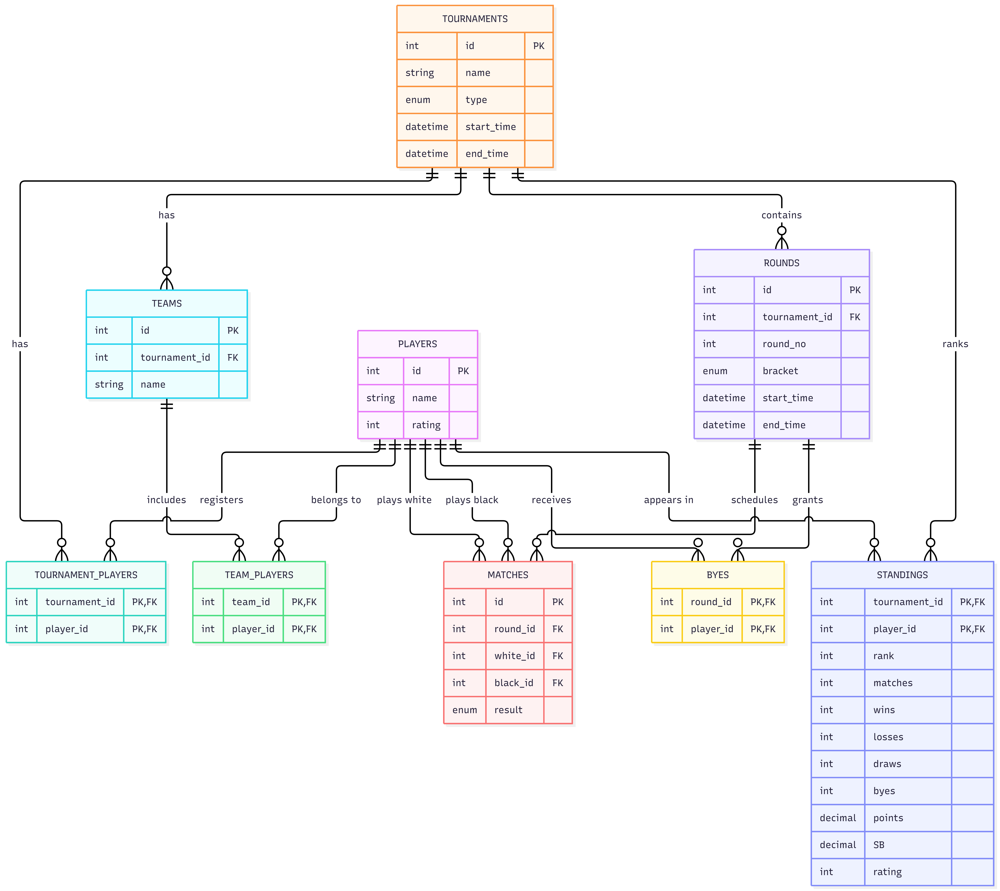

# Design Document

By Nitin Kumar Ray

Video overview : 

## Scope

The database covers:

* Player registration and ratings
* Tournament creation
* Registration of players for tournaments
* Optional team creation and team membership
* Tournament rounds
* Individual chess matches and their results
* Byes
* Tournament standings
* Tournament and match history
* Common queries for retrieving participants, matches, results, and standings

The database does not attempt to implement every rule of competitive chess. In particular, tournament-specific pairing algorithms, color-balancing algorithms, rating calculations, and other simulation logic are primarily handled by the application rather than by the database.

## Purpose

The purpose of this database is to model chess tournaments, their participants, rounds, matches, byes, teams, and final standings.

The database is designed to support multiple tournament formats:

* Knockout
* Round Robin
* Double Round Robin
* Scheveningen

The main goal is to provide a structured relational model in which tournament history can be preserved and queried after a tournament has been completed.

## Functional Requirements

The database shall support CRUD on players,tournaments,teams,rounds,matches,byes.

The system shall: 
* Register players for tournaments
* Manage Rounds 
* Store match results and byes
* Maintain tournament-specific standings
* Retrieve tournament participants, matches, results, and standings
* Preserve historical tournament data
* Maintain data integrity through keys, constraints, and triggers
* Remove tournament data safely

## Entities (Real objects)

### 3.1 Players

The `players` table represents individual chess players.

Important attributes include:

* `id` — unique identifier for a player
* `name` — player's name
* `rating` — current rating associated with the player

A player's identity is independent of any particular tournament, allowing the same player to participate in multiple tournaments.

### 3.2 Tournaments

The `tournaments` table represents individual tournaments.

Important attributes include:

* `id` — unique tournament identifier
* `name` — tournament name
* `type` — tournament format
* `start_time` — time at which the tournament was created/started
* `end_time` — time at which the tournament was completed

The `type` column is restricted to the supported tournament formats using an `ENUM`.

### 3.3 Teams

The `teams` table represents teams associated with a tournament.

A team belongs to exactly one tournament through `tournament_id`.

Teams are primarily useful for tournament formats or simulations in which players compete as members of teams.

### 3.4 Rounds

The `rounds` table represents rounds within a tournament.

Important attributes include:

* `tournament_id` — tournament to which the round belongs
* `round_no` — sequential round number
* `bracket` — whether the round belongs to the main or consolation bracket
* `start_time`
* `end_time`

### 3.5 Matches

The `matches` table represents individual chess games played during a tournament round.

Important attributes include:

* `round_id` — round in which the match occurs
* `white_id` — player playing White
* `black_id` — player playing Black
* `result` — result of the game

### 3.6 Byes

The `byes` table represents players who receive a bye in a particular round.

Byes are represented separately from matches because a bye does not involve an opponent.

### 3.7 Standings

The `standings` table stores tournament-specific statistics for players.

It includes:

* Rank
* Number of matches
* Wins
* Losses
* Draws
* Byes
* Points
* Sonneborn-Berger score (`SB`)
* Rating

The table is intentionally tournament-specific: a player's standing in one tournament is independent of their standing in another tournament.

## 4. Relationships (Junction tables)



### Player–Tournament (has)

This is a many-to-many relationship implemented through `tournament_players`.

A player can participate in multiple tournaments, and a tournament can contain multiple players.

### Tournament–Round (contains)

A tournament can contain multiple rounds, while each round belongs to exactly one tournament.

This is a one-to-many relationship.

### Round–Match (schedules)

A round can contain multiple matches, while each match belongs to exactly one round.

This is another one-to-many relationship.

### Player–Match (plays white,plays black)

A player can participate in many matches. Each match references two players through `white_id` and `black_id`.

Both columns are foreign keys to `players(id)`.

### Tournament–Team (has)

A tournament can contain multiple teams. Each team belongs to one tournament.

### Team–Player (belongs to)

Teams and players form a many-to-many relationship through `team_players`.

A team can contain multiple players, and a player can theoretically belong to multiple teams.

### Tournament–Standing (ranks)

Each player can have one standing record for each tournament in which they participate.

## Indexing and Optimization

The schema already obtains enough indexes from primary keys and unique constraints.

The `standings` table is commonly queried by tournament and sorted by points and Sonneborn-Berger score. Therefore, the following composite index can be used:

```
CREATE INDEX idx_standings_tournament_points
ON standings(tournament_id, points DESC, SB DESC);
```

Additional indexes are intentionally limited because the database is expected to contain relatively small tournament datasets, and unnecessary indexes would add storage without providing significant benefits.

## Extras

A typical tournament follows this lifecycle:

```
Create Players -> Create Tournament -> Register Players -> Create Teams (if applicable) -> Create Round -> Generate Pairings -> Record Matches/Byes -> Update Standings ->
Create Next Round -> ... -> Complete Tournament -> Store Final Standings and Results
``` 

**Views**

match_results_view : Provides elaborative data for matches

tournament_players_view : Provides elaborative data for players 

**Triggers**

check_player_round : Ensures that one player plays only once per round

check_bye_round : Ensures that one player receives only one bye per round

## Limitations

The database deliberately does not enforce every possible tournament rule.

### 12.1 Match membership

The database doesn't ensures that the players in a match are registered for the relevant tournament.

### 12.2 Standings consistency

The `standings` table stores calculated statistics.

The database does not automatically derive every value from the `matches` and `byes` tables. Therefore, it is possible for an application to create inconsistent standings if it updates the standings incorrectly.

### 12.3 Chess-specific game information

The `matches` table records the players and result of a game but does not store moves, positions, PGN notation, time controls, openings, or other game-level chess information.
